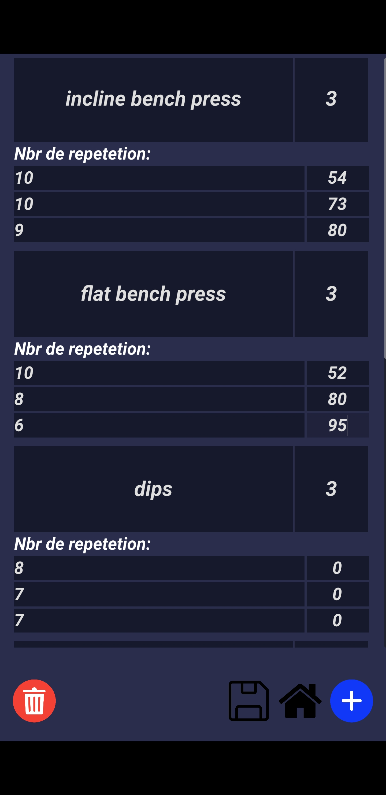

# Fit Notes

Fit Notes is a simple and intuitive application built with [Godot 4](https://godotengine.org/) to help you track and monitor your workout progress effectively.

## Interface




## Data Structure
To store workout information, we use JSON files with the following structure:

```json
{
  "workoutPlan": {
    "1": {
      "workouts": []
    },
    "2": {
      "workouts": []
    },
    "3": {
      "workouts": []
    },
    "4": {
      "workouts": []
    },
    "5": {
      "workouts": []
    },
    "6": {
      "workouts": []
    },
    "7": {
      "workouts": []
    }
  }
}
```

### Explanation
- Each day of the week is represented by a number (`1` for Monday, `2` for Tuesday, ..., `7` for Sunday).
- The `workouts` array for each day contains the details of that day's workout.

### Workout Data Structure
Each item in the `workouts` array has the following format:

```json
{
  "seriesName": "",
  "repetitions": [],
  "weights": []
}
```

#### Fields
- `seriesName`: A string representing the name of the workout series.
- `repetitions`: An array of numbers indicating the number of repetitions per set.
- `weights`: An array of numbers specifying the weights used for each set.

This simple structure makes the data easy to load and write.
